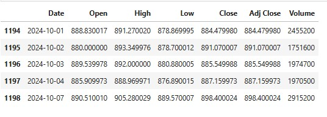
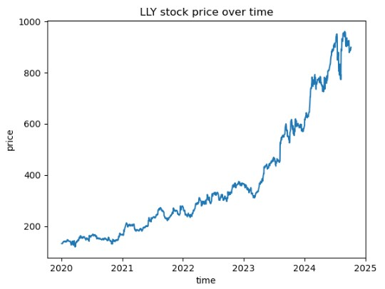
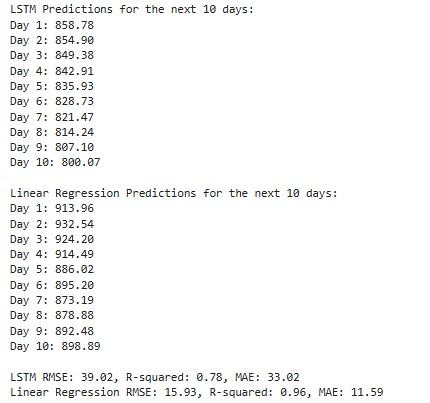
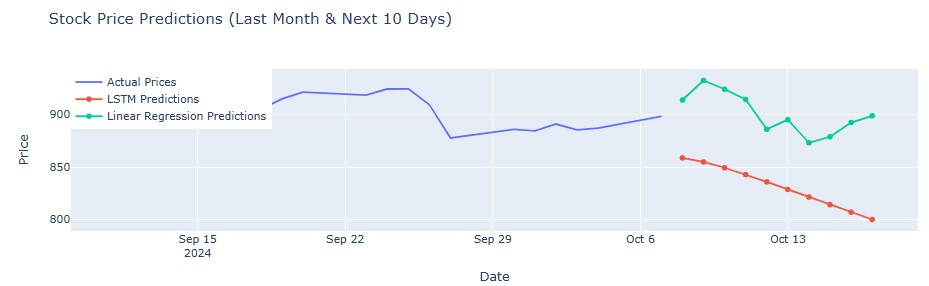

# Stock Price Prediction for Eli Lilly (LLY) Using LSTM and Linear Regression Models

## 1. Business Understanding
Long Short-Term Memory (LSTM) networks are a specialized type of Recurrent Neural Network (RNN) that excel at capturing long-range dependencies through the use of gating mechanisms to control information flow. RNNs, in general, are designed for processing sequential data, making them particularly effective for tasks in time series analysis, natural language processing, and speech recognition.

Eli Lilly and Company (LLY) is a prominent pharmaceutical company recognized for its innovative therapies, including weight loss drugs that have recently garnered considerable attention for their efficacy in managing obesity.

The objective of this project was to forecast future stock prices for Eli Lilly and Company (LLY) based on historical data. We evaluated two distinct modeling approaches: LSTM networks and Linear Regression. By comparing the strengths and weaknesses of each model, we aimed to identify the most effective method for financial forecasting.

## 2. Data Understanding
We utilized Yahoo Finance to download historical stock price data for LLY from January 1, 2020, to October 7, 2024. The dataset primarily contained the 'Close' prices, which served as our target variable for predictions.

## 3. Data Preparation
The data underwent several preprocessing steps:
- **Data Scaling**: The 'Close' prices were scaled using `MinMaxScaler` to normalize the data between 0 and 1, which was crucial for neural network training.
- **Dataset Creation**: Sequences of historical data points were created to facilitate time series modeling. For the LSTM model, the data was reshaped into a 3D array, suitable for input into LSTM layers.

## 4. Modeling
Two models were implemented:
- **LSTM Model**: 
  - LSTM layers with dropout for regularization were used to capture temporal dependencies in the data.
  - The model was trained for 50 epochs with a batch size of 32.
  
- **Linear Regression Model**:
  - A straightforward linear regression model was trained on the same dataset.
  - This model treated the last 60 days of prices as features to predict the next day's price.

## 5. Evaluation
The performance of both models was assessed using metrics like RMSE (Root Mean Squared Error), MAE (Mean Absolute Error), and R² (Coefficient of Determination). Predictions were made for the next 10 days, and results were compared visually and numerically.

## Comparison of LSTM and Linear Regression

### Pros and Cons of LSTM
**Pros:**
- **Ability to Capture Temporal Patterns**: LSTM networks are specifically designed to understand long-term dependencies, making them well-suited for time series forecasting.
- **Complexity Handling**: LSTMs can model complex relationships in the data, allowing for non-linear predictions.

**Cons:**
- **Overfitting**: Due to their complexity, LSTMs are prone to overfitting on small datasets unless regularization techniques are employed.
- **Computationally Intensive**: LSTMs require more computational resources and longer training times compared to simpler models like linear regression and ARIMA models.

### Pros and Cons of Linear Regression
**Pros:**
- **Simplicity**: It is easy to implement and interpret, making it accessible for quick analyses.
- **Less Computationally Intensive**: It requires less processing power and training time compared to LSTMs.

**Cons:**
- **Assumption of Linearity**: It assumes a linear relationship between the input features and the target variable, which does not always hold true in financial time series.
- **Limited to Short-Term Patterns**: It fails to capture long-term dependencies in the data, which are critical in time series forecasting.

## Results

[View Interactive Plot](Graphs/interactive_plot1.html)

[View Interactive Plot](Graphs/interactive_plot2.html)

## Limitations of the Project
- **Data Limitations**: The project relied on a single stock's historical data, which may not generalize to other stocks or broader market conditions.
- **Temporal Assumptions**: The models assumed that past price movements would inform future movements, which might not hold true in volatile market conditions.
- **Hyperparameter Tuning**: While basic hyperparameters were set, further tuning could potentially improve model performance.

## Conclusion
This project demonstrated the implementation of both LSTM and Linear Regression for stock price prediction. The results indicated that while LSTMs could capture complex patterns, they did not always outperform simpler models like linear regression in every context. The choice between these models should consider the specific characteristics of the dataset and the forecasting objectives. Further exploration into hyperparameter tuning and more advanced modeling techniques could enhance predictive accuracy.

## Future Directions
Future work could include:
- Exploring other architectures like GRUs or hybrid models.
- Incorporating additional features such as trading volume, market indices perfomance, sentiment analysis from news articles, fundamentals and technical indicators including but not limited to Average True Range (ATR), Fibonacci levels, support and resistance.
- Implementing cross-validation techniques to ensure the robustness of the models.
